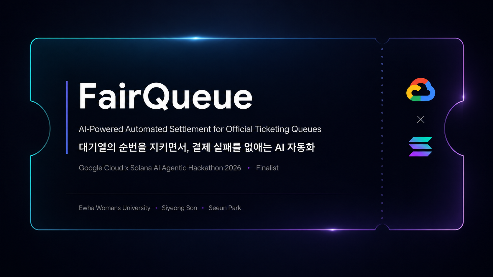
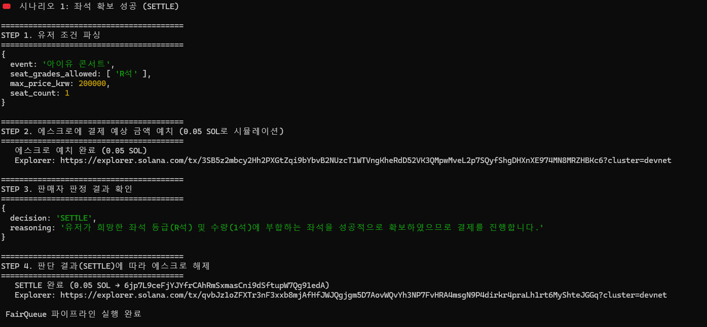
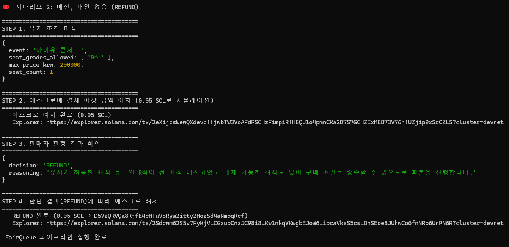
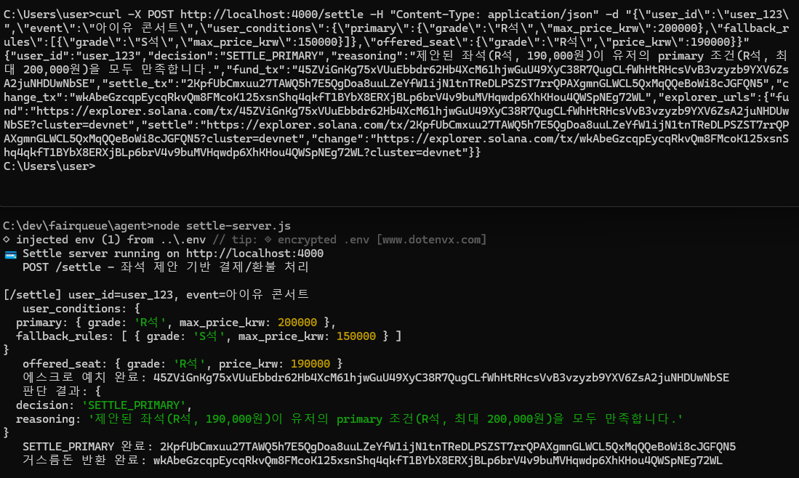

<div align="center">

<p align="center">

</p>

# 🎟️ FairQueue

### 결제 실패 없는 공식 티켓팅 보증 레이어

**Powered by Solana On-chain Escrow × Google Gemini**

[](https://explorer.solana.com/?cluster=devnet)
[](https://cloud.google.com/)
[](https://nodejs.org/)
[](#-검증-완료된-핵심-파이프라인)

**Google Cloud x Solana AI Agentic Hackathon 2026 제출작**

[문제](#-문제) · [해결책](#-해결책) · [비즈니스 모델](#-비즈니스-모델) · [검증 상태](#-검증-완료된-핵심-파이프라인) · [아키텍처](#%EF%B8%8F-아키텍처) · [기술 스택](#%EF%B8%8F-기술-스택) · [실행 방법](#-로컬-실행-방법) · [팀](#-팀)

</div>

<br>

> FairQueue는 플랫폼이 공식 대기열 순번에 따라 발급한 좌석 제안(Offer)을, 사용자가 사전에 위임한 조건과 예산 안에서 에이전트가 자동으로 정산하고, 조건이 성립하지 않으면 예치금을 자동 반환하는 온체인 결제 레이어입니다. 남보다 빨리 사도록 돕는 자동 예매 도구가 아니라, **플랫폼이 공식적으로 부여한 순번·제안에 대해서만 작동하는 B2B 결제 보증 레이어**입니다.

<br>

## Problem

| 문제 | 영향 |
|:---|:---|
| 대기열 순번이 올 때까지 자리 유무를 알 수 없음 | 유저 경험 저하 |
| 짧은 결제 시간 안에 카드 인증 오류·입력 지연으로 구매 기회를 놓치는 경우 발생 | 플랫폼의 **순수 매출 손실** |
| 매진 후 환불 처리에 시간이 걸리는 경우가 흔함 | CS 부담, 고객 불만 |
| 매크로/암표 대응 비용 | 지속적인 탐지·차단 리소스 소모 |

문제의 본질은 '대기열 우회'가 아니라, **순번을 정상적으로 받은 이후에 발생하는 실행 속도 격차**입니다. 사람은 순번 이후 수동으로 클릭하다 실패하면 처음부터 다시 시도해야 하지만, 매크로는 이 구간의 클릭을 자동화해 속도에서 유리해집니다. FairQueue는 바로 이 구간 — 순번 이후의 실행 — 을 자동화하여 격차 자체를 없앱니다.

<br>

## Solution

FairQueue는 유저가 조건과 함께 결제 예상 금액을 **온체인에 미리 예치**하게 합니다. 정상적인 공식 대기열 순서를 그대로 지키며, 순번이 되어 플랫폼이 좌석을 제안(Offer)하면 사전 위임된 조건과 비교해 자동으로 정산하거나 즉시 환불합니다. 이를 통해 결제 단계의 마찰을 줄이고, 매진 시 환불까지의 지연을 최소화하는 것을 목표로 합니다.

<div align="center">

| | 기존 매크로 | 🎟️ FairQueue |
|:---:|:---:|:---:|
| **대기열 처리** | 우회·편법 시도 | 정상 순서 그대로 (1계정 1에이전트) |
| **작동 시점** | 좌석을 스스로 탐색·선점 | 플랫폼이 공식 부여한 Offer에 대해서만 작동 |
| **플랫폼과의 관계** |  대립적 (차단 대상) | 협력적 (매출 손실 방지 인프라) |

</div>

<br>

## 비즈니스 모델

FairQueue는 결제·에스크로를 직접 운영하는 주체가 아니라, **PG사가 이미 보유한 라이선스와 인프라 위에 얹히는 자동화 솔루션 레이어**입니다. 라이선스가 필요한 자금 관리·규제 준수는 PG사가 그대로 수행하고, FairQueue는 AI 기반 조건 판단과 정산 트리거만 제공합니다.

<div align="center">

| 주체 | 역할 |
|:---|:---|
| **PG사** | 라이선스 보유 · 실제 자금 관리 · KYC 등 규제 준수 |
| **FairQueue** | AI 조건 파싱 · 판단 로직 제공 · 자동 정산 트리거 |
| **온체인 (Anchor)** | 조건부 거래를 검증 가능하게 만드는 실행 레이어로만 사용 |

</div>

```
티켓 플랫폼 (공식 순번·좌석 재고·거래 API 제공)
        ▼
   FairQueue (조건 파싱·자동 선택·정산)
        ▼
결제/정산 파트너 (실제 자금 처리·규제 준수)
```

**수익 모델**: 정률 수수료가 아닌, 월 처리 트랜잭션 규모에 따른 **구간별 고정 계약 + Volume Discount** 방식입니다. PG사 입장에서 결제 실패·환불 처리·매크로 대응에 드는 기존 비용 대비 예측 가능한 비용으로 도입할 수 있도록 설계했습니다.

| 구간 | 월 계약금 |
|:---|:---|
| Starter | 150만원 |
| Growth | 480만원 |
| Scale | 별도 협의 (Volume Discount 적용) |

**시장 기회**: 국내 공연 티켓 시장은 약 **₩1.73조** 규모(2025년 기준)이며, 콘서트 중심 고수요 이벤트에서 '순번 이후 자동화' 수요를 우선 공략합니다. Queue-it과 같은 해외 대기열·봇 방어 솔루션이 이미 시장을 형성하고 있으나, FairQueue는 그 다음 병목인 **순번 이후 좌석 자동 실행과 조건부 결제·환불**을 겨냥한다는 점에서 차별화됩니다.

<br>

## 검증 완료된 핵심 파이프라인

아래 흐름은 실제 Solana Devnet 트랜잭션, 실제 Gemini API 호출, 실제 백엔드 API 통신으로 end-to-end 검증되었습니다.

| 단계 | 검증 내용 |
|:---|:---|
| 자연어 → 조건 파싱 | Gemini가 유저 요청을 `primary` + `fallback_rules` 구조로 변환 |
| 플랫폼 API 연동 | Express 기반 좌석 상태 API와 실시간 HTTP 통신 |
| 온체인 예치 | Anchor PDA escrow에 agent keypair 자율 서명으로 Devnet 트랜잭션 발생 |
| Gemini 판단 + 결정론적 재검증 | Gemini가 제안하고, 별도의 결정론적 검증 로직이 조건 충족 여부를 한 번 더 확인 후 실행 |
| 조건별 정산/환불 | 조건 충족 시 `release`, 조건 불충족/매진 시 `refund`로 정확히 분기 |
| 데모 대시보드 | 성공 케이스와 환불 케이스를 UI에서 실행하고 Tx Hash를 Explorer로 확인 |
| 부정 패턴 탐지 (PoC) | 요청 로그 패턴을 분석해 매크로/다중 계정 의심 여부를 판정하는 개념 증명 |

세 가지 핵심 시나리오(1차 확보 성공 / 대안으로 확보 성공 / 전량 매진 후 환불) 모두 실제 Devnet에서 트랜잭션 서명·전송·확정까지 재현 가능하게 실행됩니다.

### 실행 결과 화면

<table>
<tr>
<td align="center" width="50%">

**시나리오 1 — 좌석 확보 성공 (SETTLE)**



희망 좌석 등급(R석) 및 수량 조건을 만족하는 좌석 확보 → 에스크로 예치 → `SETTLE` 판정 → 온체인 정산 완료

</td>
<td align="center" width="50%">

**시나리오 2 — 매진, 대안 없음 (REFUND)**



허용 좌석 등급(R석)이 전 좌석 매진, 대체 가능한 좌석도 없어 `REFUND` 판정 → 온체인 환불 완료

</td>
</tr>
</table>

**실제 Settle API 호출 (`curl` → `settle-server.js`)**

<p align="center">

</p>

`curl`로 `/settle` 엔드포인트에 유저 조건(`primary`, `fallback_rules`)과 제안 좌석(`offered_seat`)을 전달하면, 정산 서버가 이를 파싱해 `SETTLE_PRIMARY` 또는 `REFUND` 판정과 함께 예치(`fund_tx`)·정산/환불(`settle_tx`) 트랜잭션 해시를 Explorer 링크와 함께 반환합니다.

<br>

검증된 Anchor Program ID:

```text
618w9LmnDRNpmrTboeYfWgfgSDaDzghRzA577ciwjJuj
```

Solana Explorer(Devnet):

```text
https://explorer.solana.com/address/618w9LmnDRNpmrTboeYfWgfgSDaDzghRzA577ciwjJuj?cluster=devnet
```

<br>

## Architecture

```
[User] 자연어 조건 및 최대 예산 입력
   ▼
[Gemini] 조건 파싱 → { primary, fallback_rules }
   ▼
[Solana Devnet] Anchor PDA Escrow에 결제 대상 금액 예치 (자율 서명)
   ▼
[Official Queue] 공식 대기열 진입, 순번 대기
   ▼ (순번 도달)
[Platform Offer] 플랫폼이 좌석 제안(Offer) 발급
   ▼
[Gemini] 제안된 좌석이 조건에 맞는지 1차 판단 (근거 포함)
   ▼
[Deterministic Verification Layer] Gemini 판단을 코드 레벨에서 재검증
   │   (가격·등급이 실제 조건을 벗어나면 강제로 REFUND 처리)
   ▼
   ├─ 조건 충족 → release()로 판매자 지갑 정산
   └─ 조건 불충족/매진 → refund()로 유저/agent 지갑 환불

 결제·환불·배정 결과는 트랜잭션으로 기록되어 온체인에서 검증 가능
   (대기열 순번 자체는 애플리케이션 상태로 관리되며, 온체인에 기록되는 대상이 아님)

 모든 트랜잭션은 Solana Explorer(Devnet)에서 검증 가능
```

<br>

## Anchor Escrow Program

FairQueue의 온체인 정산은 Solana Devnet에 배포된 Anchor 프로그램으로 처리됩니다.

- `deposit` — agent 지갑이 결제 대상 금액을 escrow PDA에 예치
- `release` — 조건 충족 시 authority가 seller 지갑으로 정산
- `refund` — 조건 불충족 또는 매진 시 authority가 user/agent 지갑으로 환불
- `EscrowState` — `order_id`, `user`, `seller`, `authority`, `amount`, `status`, `bump` 저장
- 중복 실행 방지 — 이미 `Released` 또는 `Refunded` 상태인 escrow는 다시 처리되지 않음

<br>

## 왜 Solana × Google Cloud인가

<table>
<tr>
<td width="50%" valign="top">

### ◎ Solana

- **즉시성** — 예치/정산이 즉시, 저비용
- **빠른 환불** — 조건 불충족 확인 즉시 온체인 환불 처리
- **검증 가능성** — 결제·환불 트랜잭션이 온체인에 기록되어 조회 가능

</td>
<td width="50%" valign="top">

### ◎ Google Cloud / Gemini

**AI는 결제를 승인하지 않습니다.** Gemini는 사용자와 **조건을 합의**하는 역할까지만 담당하고, 최종 실행 여부는 별도의 결정론적 엔진이 결정합니다.

- **자연어 협상(Negotiation)** — 유저의 자유 형식 요청을 단순 파싱하는 데 그치지 않고, 좌석 등급 간 트레이드오프(가격·매진 가능성·구역)를 제시하며 다회차 대화로 조건을 구체화
- **구조화된 합의 결과 도출** — 협상 결과를 `primary` + `fallback_rules` 스키마로 확정해 결정론적 엔진에 전달
- **결정론적 레이어와의 역할 분리** — 최종 실행 여부는 Gemini가 아닌 별도 검증 로직이 실제 조건 데이터로 재확인 (환각 리스크 방어)

</td>
</tr>
</table>

> **현재 구현 범위**: 위 AI 파이프라인은 **Gemini Developer API** 기준으로 구현·검증되었습니다. 대시보드/플랫폼 API와 정산 API는 Google Cloud Run에 배포 가능한 Docker 기반 Node.js 서비스로 구성했습니다. Vertex AI와 Cloud KMS는 상용화 단계에서의 확장 계획입니다 — 없는 기능을 있는 것처럼 표시하지 않습니다.
>
> | 구분 | 내용 |
> |:---|:---|
> | **현재** | Gemini Developer API 기반 자연어 → 조건 구조화, Cloud Run 기반 라이브 데모 URL, Anchor Devnet 정산 |
> | **상용화 확장 (로드맵)** | Vertex AI(AI 운영·모니터링), Cloud KMS(지갑 키 관리 강화), 원화 결제망/PG 연동 |

<br>

## 기술 스택

<div align="center">

| 영역 | 기술 |
|:---|:---|
| AI | Google Gemini (Developer API) — 조건 협상 및 1차 판단 |
| 검증 | 결정론적 정책 엔진 (코드 기반 재검증 레이어) |
| 결제/온체인 | Solana Devnet, Anchor (Rust), PDA Escrow |
| Solana Client | `@coral-xyz/anchor`, `@solana/web3.js` |
| 백엔드 | Node.js, Express |
| 프론트엔드 | HTML, CSS, JavaScript 기반 데모 대시보드 |
| 배포 | Google Cloud Run, Dockerfile 기반 컨테이너 배포 |
| 지갑/서명 | Agent keypair 기반 자율 서명 (승인 팝업 없음) — *상용화 단계에서는 Google Cloud KMS 등 관리형 키 서비스로 전환 예정, 현재는 PoC 수준의 로컬 키페어 기반* |

</div>

<br>

## Demo Dashboard

데모 대시보드는 플랫폼 운영자와 심사자가 전체 흐름을 한 화면에서 확인할 수 있도록 구성했습니다.

- 예매 조건 작성: 1순위 좌석, 대안 좌석, 최대 가격, 수량 입력
- 성공 케이스: 조건 충족 좌석 Offer → `deposit` → `release`
- 환불 케이스: 조건 충족 좌석 없음 → `deposit` → `refund`
- On-chain Settlement 패널: `fund_tx`, `settle_tx`와 Solana Explorer 링크 표시
- 대기열/좌석 상태: platform simulator API와 연동

<br>

## Live Demo URL

```text
https://fairqueue-dashboard-305088341641.asia-northeast3.run.app/dashboard/
```

Cloud Run 서비스는 두 개로 분리되어 있습니다.

- `fairqueue-dashboard` — 플랫폼 시뮬레이터 API와 데모 대시보드
- `fairqueue-settle` — `/settle` 정산 API, Gemini 판단, Anchor escrow 호출

`fairqueue-dashboard`는 `SETTLE_SERVER_URL` 환경변수로 `fairqueue-settle`을 호출하며, 성공/대안/환불 케이스에서 Solana Devnet Tx Hash를 반환합니다.

<br>

## 로컬 실행 방법

```bash
git clone https://github.com/sonsiyeong977/fairqueue.git
cd fairqueue
npm install
```

`.env` 파일 설정 :

```env
GEMINI_API_KEY=your_gemini_api_key
GEMINI_MODEL=gemini-3.6-flash
SOLANA_CLUSTER=devnet
SETTLE_SERVER_URL=http://localhost:4000
SETTLE_API_KEY=fairqueue-demo-key
# 선택: 기본 Solana CLI 지갑이 아닌 경우에만 지정
# AGENT_KEYPAIR_PATH=/home/you/.config/solana/id.json
```

**터미널 1 — 정산 API 서버**
```bash
npm run settle
```

**터미널 2 — 플랫폼 시뮬레이터 + 대시보드**
```bash
npm run platform
```

대시보드 접속:

```text
http://localhost:3001/dashboard/
```

대시보드에서 성공 케이스와 환불 케이스를 실행하면 플랫폼 시뮬레이터가 `/demo/settle-offer`를 통해 정산 서버의 `/settle`을 호출하고, Anchor escrow의 `deposit` → `release` 또는 `refund` 결과 Tx Hash를 반환합니다.

<br>

## 프로젝트 구조

```
fairqueue/
├── agent/
│   ├── main.js              # 전체 파이프라인 데모 실행 스크립트
│   ├── settle-server.js     # /settle API 서버 (Gemini + Anchor escrow 호출)
│   ├── parse-test.js        # 조건 파싱 단독 테스트
│   ├── fallback-test.js     # 판단 로직 단독 테스트
│   └── fraud-detect.js      # 부정 패턴 탐지 PoC
├── anchor-escrow/
│   ├── programs/            # Anchor escrow program (deposit/release/refund)
│   └── idl/                 # 서버 호출용 Anchor IDL
├── platform-sim/
│   └── server.js            # 좌석/대기열/Offer 상태 관리 Express API
├── dashboard/
│   └── index.html           # 데모 대시보드
├── start.js                 # Cloud Run에서 platform/settle 서비스를 선택 실행
├── Dockerfile               # Cloud Run 배포용 Node.js 컨테이너 정의
├── docs/
│   ├── images/               # README용 스크린샷
│   ├── PLATFORM_SIM_API.md  # 플랫폼 시뮬레이터 API 문서
│   └── PRODUCT_INTRO.md     # 프로덕트 소개서
└── README.md
```

<br>

## 기준

<div align="center">

| 기준 | 대응 내용 |
|:---|:---|
| 혁신성 및 UX | 조건 위임 기반 자동 정산 + 즉시 환불 + 결정론적 검증으로 안전성 확보 |
| AI 활용도 | Gemini 기반 자연어 협상 · 근거 있는 판단 · 결정론적 레이어와의 역할 분리 |
| 인프라 연동 | 현재 구현: Solana Devnet + Anchor PDA Escrow, Gemini Developer API, Google Cloud Run / 확장 로드맵: USDC·Solana Pay, Vertex AI·Cloud KMS |
| 실제 구동 여부 | 실제 Devnet 트랜잭션과 데모 대시보드로 검증 |

</div>

<br>

## Team

**Team Tickety**

<div align="center">

| 이름 | 역할 | GitHub |
|:---:|:---|:---:|
| **손시영** | PM · 백엔드 · AI · 온체인 | [@sonsiyeong977](https://github.com/sonsiyeong977) |
| **박세은** | 대기열 시스템 · 프론트엔드 | [@seeun68](https://github.com/seeun68) |

이화여자대학교 데이터사이언스학과

</div>

<br>

## License

MIT

<br>

<div align="center">

**Built with 💜for Google Cloud x Solana AI Agentic Hackathon 2026💜**

</div>
