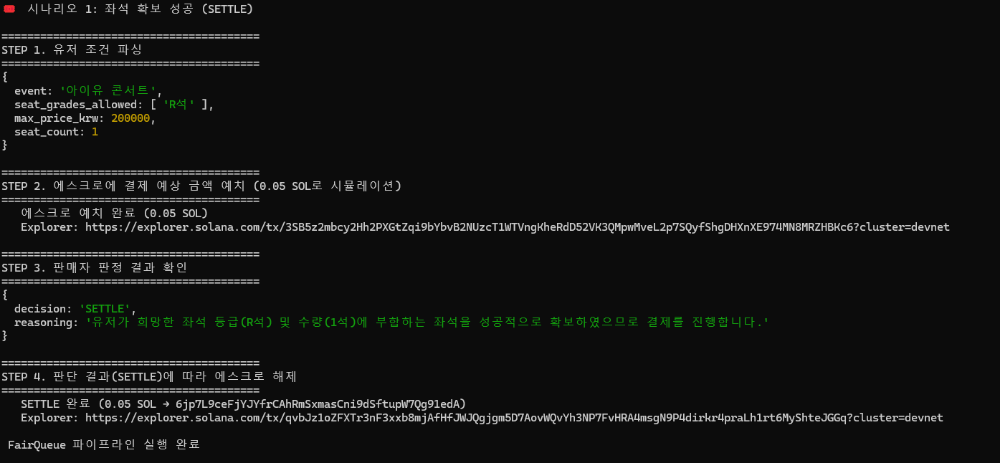
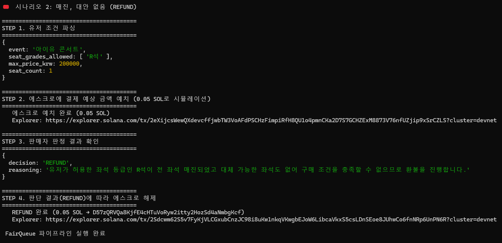
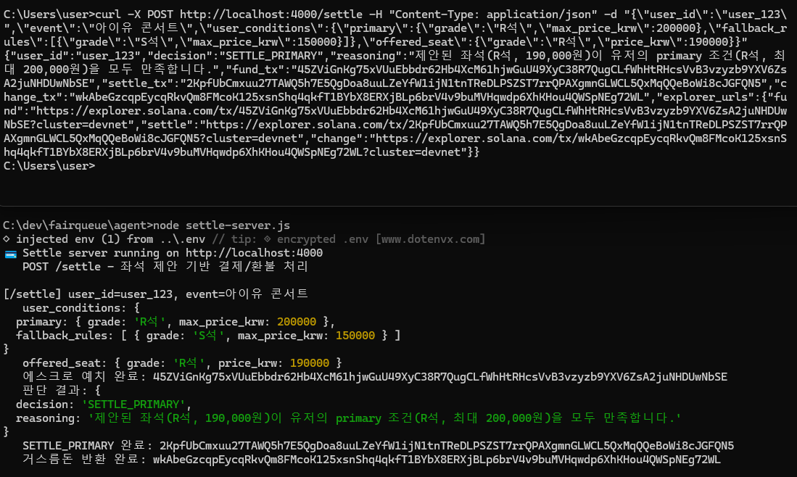

<div align="center">

<p align="center">

</p>

# 🎟️ FairQueue

### An Official Ticketing Assurance Layer Designed to Prevent Payment Failures

**Powered by Solana On-chain Escrow × Google Gemini**

[](https://explorer.solana.com/?cluster=devnet)
[](https://cloud.google.com/)
[](https://nodejs.org/)
[](#verified-core-pipeline)

**A submission to the Google Cloud x Solana AI Agentic Hackathon 2026**

[Problem](#problem) · [Solution](#solution) · [Business Model](#business-model) · [Verification Status](#verified-core-pipeline) · [Architecture](#architecture) · [Tech Stack](#tech-stack) · [Local Setup](#local-setup) · [Team](#team)

</div>

<br>

> FairQueue is an on-chain payment layer that lets an agent automatically settle platform-issued seat offers within a user's preauthorized conditions and budget, or return the deposit when those conditions are not met. Rather than helping users buy faster than others, it is a **B2B ticketing assurance layer that operates only on queue positions and offers officially granted by the platform**.

<br>

## Problem

| Problem | Impact |
|:---|:---|
| Users cannot know whether seats will remain available until their queue turn | Poor user experience |
| Card authentication errors and input delays can cause users to miss the short payment window | **Lost sales revenue** for platforms |
| Refunds after a sellout can take time | Customer support workload and dissatisfaction |
| Countering bots and ticket scalping | Ongoing detection and blocking costs |

The core issue is not queue bypassing, but the **execution-speed gap after users legitimately reach their turn**. Users who fail during manual seat selection and checkout may have to start over, while bots gain a speed advantage by automating those actions. FairQueue aims to close this gap by automating execution after the official queue turn.

<br>

## Solution

FairQueue allows users to specify their conditions and **deposit the expected payment amount on-chain in advance**. It preserves the official queue order. When the platform issues a seat offer at the user's turn, FairQueue compares it against the preauthorized conditions and automatically settles or refunds the deposit. The goal is to reduce checkout friction and minimize refund delays when no acceptable seats remain.

<div align="center">

| | Conventional Bots | 🎟️ FairQueue |
|:---:|:---:|:---:|
| **Queue Handling** | Attempt bypasses or workarounds | Preserve the official order (one agent per account) |
| **Execution Trigger** | Independently search for and secure seats | Act only on officially issued platform offers |
| **Platform Relationship** | Adversarial (subject to blocking) | Cooperative (infrastructure to prevent lost sales) |

</div>

<br>

## Business Model

FairQueue's proposed commercial model is an **automation layer built on the licenses and infrastructure of existing payment service providers (PSPs)**, rather than an independent payment or escrow operator. The PSP would retain responsibility for regulated fund management and compliance, while FairQueue would provide AI-based condition evaluation and settlement triggers.

<div align="center">

| Participant | Role |
|:---|:---|
| **Payment Service Provider (PSP)** | Licensing, actual fund management, and regulatory compliance such as KYC |
| **FairQueue** | AI condition parsing, decision logic, and automated settlement triggers |
| **On-chain Layer (Anchor)** | Execution layer for verifiable conditional transactions |

</div>

```text
Ticketing Platform (official queue, seat inventory, transaction APIs)
        ▼
   FairQueue (condition parsing, automated selection, settlement)
        ▼
Payment / Settlement Partner (actual fund processing, compliance)
```

**Revenue Model**: Instead of a percentage-based transaction fee, the proposed pricing uses **fixed monthly tiers based on transaction volume, with volume discounts**. It is designed to give PSPs predictable costs relative to their existing expenses for payment failures, refunds, and bot prevention.

| Tier | Monthly Contract Fee |
|:---|:---|
| Starter | KRW 1,500,000 |
| Growth | KRW 4,800,000 |
| Scale | Custom pricing with volume discounts |

**Market Opportunity**: The South Korean live performance ticket market is approximately **KRW 1.73 trillion** (2025). FairQueue initially targets post-queue automation for high-demand events, particularly concerts. While queue management and bot defense solutions such as Queue-it already serve this market, FairQueue focuses on the next bottleneck: **automated seat acceptance and conditional payment or refund after the queue turn**.

<br>

## Verified Core Pipeline

The following flow has been verified end to end using actual Solana Devnet transactions, Gemini API calls, and backend API communication.

| Stage | Verification |
|:---|:---|
| Natural Language → Conditions | Gemini converts user requests into a `primary` + `fallback_rules` structure |
| Platform API Integration | Real-time HTTP communication with an Express-based seat availability API |
| On-chain Deposit | Agent keypair signs Devnet transactions to deposit funds into an Anchor PDA escrow |
| Gemini Decision + Deterministic Verification | Gemini proposes a decision; separate deterministic logic checks the conditions again before execution |
| Conditional Settlement / Refund | Execute `release` when conditions are met, or `refund` when conditions fail or seats sell out |
| Demo Dashboard | Run success and refund scenarios through the UI and inspect transaction hashes in Explorer |
| Fraud Pattern Detection (PoC) | Proof of concept analyzing request logs for suspected bots or multiple-account activity |

All three core scenarios (primary seat success, fallback seat success, and refund after a sellout) can be reproduced on Devnet through transaction signing, submission, and confirmation.

### Execution Screenshots

<table>
<tr>
<td align="center" width="50%">

**Scenario 1 — Seats Secured (SETTLE)**



Secure seats matching the requested grade (R) and quantity → escrow deposit → `SETTLE` decision → on-chain settlement completed

</td>
<td align="center" width="50%">

**Scenario 2 — Sold Out, No Fallback (REFUND)**



All seats in the permitted grade (R) are sold out, with no acceptable alternative → `REFUND` decision → on-chain refund completed

</td>
</tr>
</table>

**Actual Settle API Call (`curl` → `settle-server.js`)**

<p align="center">

</p>

Sending user conditions (`primary`, `fallback_rules`) and an offered seat (`offered_seat`) to `/settle` with `curl` lets the settlement server evaluate the request and return a decision such as `SETTLE_PRIMARY` or `REFUND`, together with deposit (`fund_tx`) and settlement/refund (`settle_tx`) transaction hashes and Explorer links.

<br>

Verified Anchor Program ID:

```text
618w9LmnDRNpmrTboeYfWgfgSDaDzghRzA577ciwjJuj
```

Solana Explorer (Devnet):

```text
https://explorer.solana.com/address/618w9LmnDRNpmrTboeYfWgfgSDaDzghRzA577ciwjJuj?cluster=devnet
```

<br>

## Architecture

```text
[User] Enter natural-language conditions and a maximum budget
   ▼
[Gemini] Parse conditions → { primary, fallback_rules }
   ▼
[Solana Devnet] Deposit payment funds into an Anchor PDA escrow (agent-signed)
   ▼
[Official Queue] Join the official queue and wait for the assigned turn
   ▼ (turn reached)
[Platform Offer] Platform issues a seat offer
   ▼
[Gemini] Evaluate whether the offered seats meet the conditions (with reasoning)
   ▼
[Deterministic Verification Layer] Recheck Gemini's decision in code
   │   (force REFUND if price or grade violates the actual conditions)
   ▼
   ├─ Conditions met → release() settles funds to the seller wallet
   └─ Conditions not met / sold out → refund() returns funds to the user/agent wallet

 Payment, refund, and allocation outcomes are recorded through transactions
 and can be verified on-chain.
 (Queue positions are application state, not on-chain records.)

 All transactions can be inspected in Solana Explorer (Devnet).
```

<br>

## Anchor Escrow Program

FairQueue's on-chain settlement is handled by an Anchor program deployed on Solana Devnet.

- `deposit` — The agent wallet deposits payment funds into an escrow PDA.
- `release` — The authority settles funds to the seller wallet when conditions are met.
- `refund` — The authority returns funds to the user/agent wallet when conditions fail or seats sell out.
- `EscrowState` — Stores `order_id`, `user`, `seller`, `authority`, `amount`, `status`, and `bump`.
- Duplicate execution prevention — An escrow in the `Released` or `Refunded` state cannot be processed again.

<br>

## Why Solana × Google Cloud?

<table>
<tr>
<td width="50%" valign="top">

### ◎ Solana

- **Speed** — Fast, low-cost deposits and settlement.
- **Fast Refunds** — On-chain refunds can be initiated as soon as unmet conditions are confirmed.
- **Verifiability** — Payment and refund transactions are recorded on-chain and can be inspected.

</td>
<td width="50%" valign="top">

### ◎ Google Cloud / Gemini

**AI does not authorize payments.** Gemini helps users **agree on conditions**, while a separate deterministic engine determines whether execution is permitted.

- **Natural-language Negotiation** — Beyond parsing free-form requests, the intended negotiation flow clarifies conditions through multiple exchanges, presenting seat-grade tradeoffs such as price, sellout likelihood, and location.
- **Structured Agreement** — Finalize the agreed conditions as a `primary` + `fallback_rules` schema for the deterministic engine.
- **Separation from Deterministic Verification** — Independent verification logic checks actual condition data before execution, reducing the risk of AI hallucinations.

</td>
</tr>
</table>

> **Current Implementation Scope**: The AI pipeline has been implemented and verified using the **Gemini Developer API**. The dashboard/platform API and settlement API are Docker-based Node.js services deployable to Google Cloud Run. Vertex AI and Cloud KMS are planned extensions for commercialization, not current features.
>
> | Scope | Details |
> |:---|:---|
> | **Current** | Natural-language condition structuring with the Gemini Developer API, a Cloud Run live demo URL, and Anchor Devnet settlement |
> | **Commercialization Roadmap** | Vertex AI (AI operations and monitoring), Cloud KMS (stronger wallet key management), and integration with KRW payment networks / PSPs |

<br>

## Tech Stack

<div align="center">

| Area | Technology |
|:---|:---|
| AI | Google Gemini (Developer API) — condition negotiation and initial evaluation |
| Verification | Deterministic policy engine (code-based verification layer) |
| Payments / On-chain | Solana Devnet, Anchor (Rust), PDA Escrow |
| Solana Client | `@coral-xyz/anchor`, `@solana/web3.js` |
| Backend | Node.js, Express |
| Frontend | HTML, CSS, and JavaScript demo dashboard |
| Deployment | Google Cloud Run with Dockerfile-based containers |
| Wallet / Signing | Autonomous agent keypair signing (no approval pop-up) — *currently a PoC using local keypairs; planned migration to managed key services such as Google Cloud KMS for commercialization* |

</div>

<br>

## Demo Dashboard

The demo dashboard lets platform operators and judges inspect the complete flow in one place.

- Booking conditions: primary seat grade, fallback grade, maximum price, and quantity.
- Success scenario: a matching seat offer → `deposit` → `release`.
- Refund scenario: no matching seats → `deposit` → `refund`.
- On-chain Settlement panel: `fund_tx`, `settle_tx`, and Solana Explorer links.
- Queue and seat status: integrated with the platform simulator API.

<br>

## Live Demo URL

```text
https://fairqueue-dashboard-305088341641.asia-northeast3.run.app/dashboard/
```

The deployment consists of two Cloud Run services.

- `fairqueue-dashboard` — Platform simulator API and demo dashboard.
- `fairqueue-settle` — `/settle` API, Gemini evaluation, and Anchor escrow calls.

`fairqueue-dashboard` calls `fairqueue-settle` using the `SETTLE_SERVER_URL` environment variable and returns Solana Devnet transaction hashes for primary success, fallback success, and refund scenarios.

<br>

## Local Setup

```bash
git clone https://github.com/sonsiyeong977/fairqueue.git
cd fairqueue
npm install
```

Configure `.env`:

```env
GEMINI_API_KEY=your_gemini_api_key
GEMINI_MODEL=gemini-3.6-flash
SOLANA_CLUSTER=devnet
SETTLE_SERVER_URL=http://localhost:4000
SETTLE_API_KEY=fairqueue-demo-key
# Optional: specify only when using a wallet other than the default Solana CLI wallet
# AGENT_KEYPAIR_PATH=/home/you/.config/solana/id.json
```

**Terminal 1 — Settlement API Server**
```bash
npm run settle
```

**Terminal 2 — Platform Simulator + Dashboard**
```bash
npm run platform
```

Open the dashboard:

```text
http://localhost:3001/dashboard/
```

When success or refund scenarios are run from the dashboard, the platform simulator calls the settlement server's `/settle` endpoint through `/demo/settle-offer` and returns transaction hashes for the Anchor escrow's `deposit` → `release` or `refund` flow.

<br>

## Project Structure

```text
fairqueue/
├── agent/
│   ├── main.js              # Full pipeline demo script
│   ├── settle-server.js     # /settle API server (Gemini + Anchor escrow)
│   ├── parse-test.js        # Standalone condition parsing test
│   ├── fallback-test.js     # Standalone decision logic test
│   └── fraud-detect.js      # Fraud detection PoC
├── anchor-escrow/
│   ├── programs/            # Anchor escrow program (deposit/release/refund)
│   └── idl/                 # Anchor IDL for server calls
├── platform-sim/
│   └── server.js            # Express API for seats, queue, and offers
├── dashboard/
│   └── index.html           # Demo dashboard
├── start.js                 # Select platform/settle service on Cloud Run
├── Dockerfile               # Node.js container for Cloud Run deployment
├── docs/
│   ├── images/               # README screenshots
│   ├── PLATFORM_SIM_API.md  # Platform simulator API documentation
│   └── PRODUCT_INTRO.md     # Product introduction
└── README.md
```

<br>

## Evaluation Criteria

<div align="center">

| Criterion | Project Response |
|:---|:---|
| Innovation and UX | Condition-based automated settlement, immediate refunds, and deterministic verification |
| AI Usage | Gemini-based natural-language negotiation, reasoned evaluation, and separation from deterministic verification |
| Infrastructure Integration | Current: Solana Devnet + Anchor PDA Escrow, Gemini Developer API, Google Cloud Run / Roadmap: USDC, Solana Pay, Vertex AI, Cloud KMS |
| Working Implementation | Verified through actual Devnet transactions and the demo dashboard |

</div>

<br>

## Team

**Team Tickety**

<div align="center">

| Name | Role | GitHub |
|:---:|:---|:---:|
| **Siyeong Son** | PM, Backend, AI, On-chain | [@sonsiyeong977](https://github.com/sonsiyeong977) |
| **Seeun Park** | Queue System, Frontend | [@seeun68](https://github.com/seeun68) |

Department of Data Science, Ewha Womans University

</div>

<br>

## License

MIT

<br>

<div align="center">


</div>
