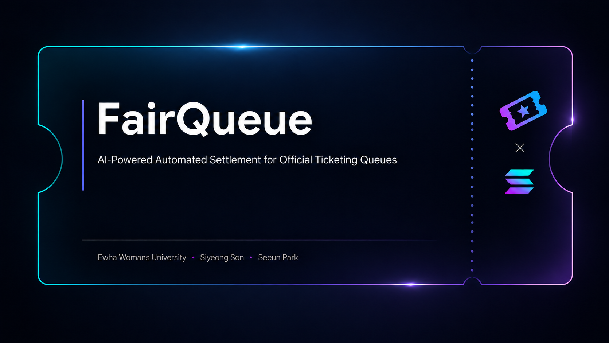

<div align="center">



# FairQueue

### AI-Assisted Ticket Booking and Conditional On-Chain Settlement

**Google Gemini + Solana Anchor Escrow + x402 Agent Payments**

[Overview](#overview) | [Booking Flow](#booking-flow) | [Architecture](#architecture) | [Tech Stack](#tech-stack) | [Local Setup](#local-setup) | [Transactions](#devnet-transactions) | [Team](#team)

</div>

## Overview

FairQueue is a condition-based ticket booking and payment layer. Buyers describe
the seats they want, review the interpreted conditions, and join the platform
queue. At their turn, the platform selects an offer, checks it against the approved
conditions, and processes an escrow deposit followed by settlement or refund.

FairQueue operates within the platform's queue order rather than bypassing it.
Gemini interprets booking intent; independent code validates the offer and payment
transaction. Funds are handled by the Anchor escrow program on Solana Devnet.

The included platform simulator provides three fictional performances: a concert,
a musical, and a festival. Its storefront presents dates, sections, prices, sale
status, ticket limits, and a seating guide before entering a booking session.
Transactions use Devnet test SOL; KRW values are reference ticket prices.

## Booking Flow

1. **Browse performances.** Select an event, date, ticket quantity, and optionally
   a preferred section in the storefront.
2. **Describe booking conditions.** Use English or Korean natural language, the
   selection controls, or both.
3. **Review the interpretation.** Gemini structures a primary rule and ordered
   alternatives. The buyer checks sections, price caps, quantity, adjacency,
   split-seat permission, and restricted-view preferences.
4. **Choose a payment method.** Use the server demo wallet or connect a buyer
   wallet through Wallet Standard on Solana Devnet.
5. **Join the platform queue.** The buyer waits for the assigned turn. Seat
   parsing does not reserve inventory.
6. **Validate the offer.** At the queue turn, the platform creates a seat hold and
   checks the offer against the approved rules with deterministic code.
7. **Fund the escrow.** In browser-wallet mode, x402 requests an escrow deposit.
   The client validates the transaction, displays its costs, and requests an
   explicit buyer signature. The server demo mode signs with its own keypair.
8. **Release or refund.** The authority releases principal to the seller for an
   accepted offer or refunds it to the escrow's buyer address. The result shows
   transaction signatures and Solana Explorer links.

### Natural-Language Example

```text
Avoid restricted-view seats. First, find 2 adjacent seats in VIP A,
up to KRW 176,000 per ticket. If unavailable, try VIP B at the same
price limit; separate seats are acceptable. If that also fails,
find 2 adjacent seats in R 1, up to KRW 154,000 per ticket.
Do not accept any other sections or exceed these price limits.
```

Each alternative has its own conditions and priority. When a request omits
alternatives, the selected controls supply them. Explicit instructions such as
`No alternatives` override the alternative controls. Buyers review the structured
request before entering the queue.

## Architecture

```text
Vite / React Ticket Storefront
    |
    v
Booking Session + Gemini Condition Parsing
    |
    v
Express Platform API
    |-- Performance catalog, sale-opening checks and seat inventory
    |-- Platform queue and seat holds
    |-- Deterministic offer verification
    |
    v
Payment Mode
    |-- Server demo wallet -> /settle
    |-- Buyer wallet -> HTTP 402 -> validation -> signature -> /x402/settle
    |
    v
Solana Devnet Anchor Escrow
    |-- deposit: create and fund an escrow PDA
    |-- release: transfer principal to the seller
    |-- refund: return principal to the buyer
    |
    v
Result + Explorer Links + Browser-Local Booking History
```

The platform API manages queue, inventory, hold, and order state in its process.
The storefront stores demo profiles and booking history in the browser. Escrow
deposits, releases, and refunds are recorded on-chain.

### x402 Escrow Payments

The buyer-wallet path uses x402 V2 payment headers and the official client SDK
with a custom **`fairqueue-escrow`** scheme for native Devnet SOL deposits.
The HTTP 402 response contains the transaction and its payment requirements.

Before signing, the client checks the buyer, authority, seller, program, escrow
PDA, queue, approved conditions, amount, expiry, and instructions. The server
checks the buyer signature and exact quoted transaction before submission.
Quotes include a fixed compute budget and zero priority fee. A fresh confirmed
blockhash and its context are used for submission; quotes expire within 30 seconds.

Explicit blockhash rejection before broadcast allows cancellation. When submission
or finalization is uncertain, the flow blocks another deposit and offers a payment
status check. Wallet connection alone does not submit a transaction.

### Escrow Costs

The wallet approval screen separates deposit principal, account storage balance,
and the deposit network fee. A principal refund returns the deposited amount to
the buyer; network fees are separate. The storage balance remains in the escrow
account after release or refund. The authority pays the release/refund transaction
fee. The refund demonstration creates a test deposit even when no offer matches.

## Tech Stack

| Area | Technology |
|:---|:---|
| Natural-language conditions | Google Gemini Developer API |
| Offer and transaction verification | Deterministic JavaScript policy checks |
| Storefront | Vite, React, TypeScript, React Router, Lucide icons |
| Booking session and dashboard | HTML, CSS, JavaScript |
| Platform and settlement APIs | Node.js, Express |
| Browser wallet connection | Wallet Standard, Solana transaction signing |
| Agent payment protocol | `@x402/core`, `@x402/fetch`, custom escrow scheme |
| On-chain escrow | Solana Devnet, Anchor, Rust, PDA accounts |
| Solana clients | `@solana/web3.js`, `@coral-xyz/anchor` |
| Container deployment | Docker, Google Cloud Run |
| Tests | Node.js test runner; Playwright browser checks |

## Local Setup

### Prerequisites

- Node.js and npm.
- A Gemini API key and a model available to that API project.
- A backend Solana keypair funded with Devnet SOL for transaction fees.
- For buyer-wallet payments, a separate funded Devnet wallet in a Wallet
  Standard-compatible browser extension. Phantom has been used for verification.

### Install and Build

```bash
git clone --branch ver2 https://github.com/sonsiyeong977/fairqueue.git
cd fairqueue
npm install
npm --prefix storefront install
npm --prefix storefront run build
```

### Configure Environment Variables

Create `.env` in the repository root and replace the placeholders:

```env
GEMINI_API_KEY=your_gemini_api_key
GEMINI_MODEL=your_available_gemini_model_id
SOLANA_CLUSTER=devnet
SETTLE_SERVER_URL=http://localhost:4000
SETTLE_API_KEY=your_long_shared_server_secret
X402_ESCROW_ENABLED=true

# Optional: defaults to ~/.config/solana/id.json
# AGENT_KEYPAIR_PATH=/absolute/path/to/backend-keypair.json

# Optional: seller public address; defaults to the backend wallet
# SELLER_PUBKEY=your_devnet_seller_public_key
```

Both services must use the same `SETTLE_API_KEY`. Keep API keys, keypair files,
and wallet recovery phrases out of source control. The backend keypair acts as
escrow authority; the connected buyer wallet signs its own deposit.

### Start Both Services

Terminal 1: settlement API, default port `4000`.

```bash
npm run settle
```

Terminal 2: platform API and storefront, default port `3001`.

```bash
npm run platform
```

Open [Ticket Storefront](http://localhost:3001/storefront/) or
[Demo Dashboard](http://localhost:3001/dashboard/).

Set `PORT` separately for each process to use different ports, and update
`SETTLE_SERVER_URL` accordingly. When the platform runs on Windows and settlement
runs in WSL, use the reachable WSL IP and settlement port for that URL.

### Run a Buyer-Wallet Booking

1. Enable Solana Devnet in the wallet and fund the buyer with test SOL.
2. Select a performance and review its interpreted booking conditions.
3. Select **My wallet · Devnet**, connect, and check the address and balance.
4. Join the queue, review the deposit costs, and approve the wallet signature
   before the quote expires.
5. Open the deposit and release/refund links on Solana Explorer.

For a refund demonstration, request one R 1 ticket for the ORBIT/9 November 20
performance with a KRW 100,000 price cap and no alternatives. Its face value is
KRW 154,000, so the request produces a principal refund rather than assigned seats.

### Run Tests

```bash
npm test
```

Automated API and payment-policy tests use mocked chain submission and do not
transfer Devnet SOL. See [Booking and Payment Guide](docs/VER2-BOOKING.md) for
additional integration details.

## Devnet Transactions

Anchor program: [618w9LmnDRNpmrTboeYfWgfgSDaDzghRzA577ciwjJuj](https://explorer.solana.com/address/618w9LmnDRNpmrTboeYfWgfgSDaDzghRzA577ciwjJuj?cluster=devnet).

| Buyer-Wallet Scenario | Deposit | Outcome |
|:---|:---|:---|
| R 1 ticket settlement | [Deposit](https://explorer.solana.com/tx/3uaZxzvbb7pPu7hzBsgWW7eJgEuvmUnQV2PpyyVkT8RpmeTMFguVePST7CxxzTqL37UXTw2kqhtwe3va5YATKFdH?cluster=devnet) | [Release](https://explorer.solana.com/tx/5FnReE467hm5fTCFfKHvia7JcAvSXPEgkftZ79HadT3e3DrkP2knYkc1nkWpyTmZdj28Fof46T7WZzVoqet7JBsg?cluster=devnet) |
| No matching offer at the approved price | [Deposit](https://explorer.solana.com/tx/3oSTLVPvos9b584dbzy6d6QBDyVQXaSatuispFw4mrn9Fv7tgtByAabxkbfizHYMTmpUcFcVPvtCviZmHWS2Mzga?cluster=devnet) | [Refund](https://explorer.solana.com/tx/5MWJk35aEwQvYcL3eeixp6TAyreTKmovhHyzvgroVSZSxUmubtLUh187SCEEZ2bPtdnKuRTFcWYBgFXKBuiDMCE8?cluster=devnet) |

These examples were checked against Devnet transaction records for successful
execution, buyer address, matching order IDs, and principal movement.

## Hosted Dashboard

[Open the Cloud Run dashboard](https://fairqueue-dashboard-305088341641.asia-northeast3.run.app/dashboard/).

The hosted dashboard uses separate platform and settlement Cloud Run services.
The browser-wallet storefront described here runs from the `ver2` source and local
setup; the hosted URL is the existing dashboard deployment.

## Project Structure

```text
fairqueue/
  agent/                 Settlement API, Anchor adapter and x402 payment handler
  anchor-escrow/         Rust escrow program and Anchor IDL
  dashboard/            Booking session and operator demo dashboard
  platform-sim/         Performance catalog, queue, holds and inventory APIs
  shared/               Client/server escrow payment policy
  storefront/           Vite + React + TypeScript ticket storefront
  tests/                API and payment-policy tests
  docs/                 Integration documentation and screenshots
  Dockerfile            Node.js deployment container
  start.js              Platform/settlement service entry point
```

## Team

## License

MIT
